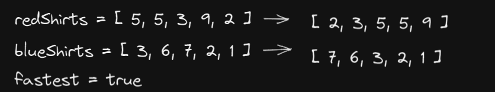

# Tandem Bicycle

- [Link to problem](https://www.algoexpert.io/questions/Tandem%20Bicycle)

## Solution

```js
function tandemBicycle(redShirtSpeeds, blueShirtSpeeds, fastest) {
  redShirtSpeeds.sort((a, b) => a - b); // 1
  blueShirtSpeeds.sort((a, b) => a - b);

  if (fastest) blueShirtSpeeds.reverse(); // 2

  let res = 0;
  for (let i = 0; i < redShirtSpeeds.length; i += 1) {
    res += Math.max(redShirtSpeeds[i], blueShirtSpeeds[i]); // 3
  }

  return res.reduce((a, c) => a + c, 0);
}
```

### Explanation



1. Sort both inputs in non-decreasing order
2. If we are looking for the fastest bike then reverse one of the inputs
3. Start iterating over both inputs and compare the values in both arrays at each index. Add the greater value to the result. We do this because the speed of the bike is _always_ going to be the faster bike. Because we reverse the input if we are looking for the fastest, by adding the max we will end up with the fastest possible speeds. Otherwise we will endup with the slowest speeds.
