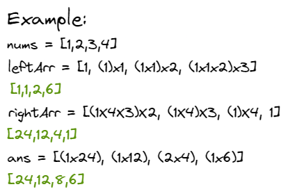

# Product of Array Except Self

- [Link to problem](https://leetcode.com/problems/product-of-array-except-self/)
  - [Fantastic explanation](<https://leetcode.com/problems/product-of-array-except-self/discuss/694266/Javascript-Solution-(No-Division)-(With-Explanation)>)

# Solution 1

```js
var productExceptSelf = function (nums) {
  let left = [],
    right = [];
  let leftNum = 1,
    rightNum = 1;

  nums.forEach((num, i) => {
    left[i] = leftNum;
    leftNum *= nums[i];
  });

  for (let i = nums.length - 1; i >= 0; i -= 1) {
    right[i] = rightNum;
    rightNum *= nums[i];
    // We can do the final multiplication here to save an extra iteration at the end.
    right[i] *= left[i];
  }

  return right;
};
```

## Explanation



1. Create one array with incremental multiplication starting from the left and other starting from the right. The first element in each array will be `1` because we have no multiplication prior to it.
2. After performing both iterations, in the left array we will have the mutiples of the left elements prior to that index and in the right array we will have the multiples of all the elements to the right of that index.
3. By multiplying the index of each array, we can calcuate the answer.
